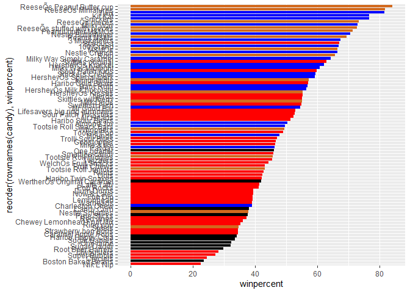
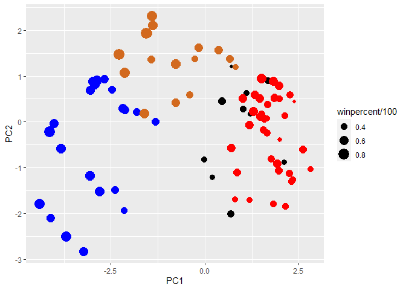

Class 10: Halloween Candy
================
10/28/22

In this mini-project we will examine 538 Halloween Candy data.

``` r
candy_file <- "https://raw.githubusercontent.com/fivethirtyeight/data/master/candy-power-ranking/candy-data.csv"
```

``` r
candy = read.csv(candy_file,row.names=1)
head(candy)
```

                 chocolate fruity caramel peanutyalmondy nougat crispedricewafer
    100 Grand            1      0       1              0      0                1
    3 Musketeers         1      0       0              0      1                0
    One dime             0      0       0              0      0                0
    One quarter          0      0       0              0      0                0
    Air Heads            0      1       0              0      0                0
    Almond Joy           1      0       0              1      0                0
                 hard bar pluribus sugarpercent pricepercent winpercent
    100 Grand       0   1        0        0.732        0.860   66.97173
    3 Musketeers    0   1        0        0.604        0.511   67.60294
    One dime        0   0        0        0.011        0.116   32.26109
    One quarter     0   0        0        0.011        0.511   46.11650
    Air Heads       0   0        0        0.906        0.511   52.34146
    Almond Joy      0   1        0        0.465        0.767   50.34755

Q1. How many differeny candy types are in this dataset?

``` r
nrow(candy)
```

    [1] 85

Q2. How many fruity candy types are in this dataset?

``` r
sum(candy$fruity)
```

    [1] 38

Q3. What is your favorite candy in the dataset and what is it’s
`winpercent` value?

``` r
candy["Kit Kat", ]$winpercent
```

    [1] 76.7686

The winpercent for Kit Kat is 76.7686

Q4. What is the winpercent value for “Kit Kat”?

``` r
candy["Kit Kat", ]$winpercent
```

    [1] 76.7686

The winpercent for Kit Kat is 76.7686

Q5. What is the winpercent value for “Tootsie Roll Snack Bars”?

``` r
candy["Tootsie Roll Snack Bars", ]$winpercent
```

    [1] 49.6535

``` r
skimr::skim(candy)
```

|                                                  |       |
|:-------------------------------------------------|:------|
| Name                                             | candy |
| Number of rows                                   | 85    |
| Number of columns                                | 12    |
| \_\_\_\_\_\_\_\_\_\_\_\_\_\_\_\_\_\_\_\_\_\_\_   |       |
| Column type frequency:                           |       |
| numeric                                          | 12    |
| \_\_\_\_\_\_\_\_\_\_\_\_\_\_\_\_\_\_\_\_\_\_\_\_ |       |
| Group variables                                  | None  |

Data summary

**Variable type: numeric**

| skim_variable    | n_missing | complete_rate |  mean |    sd |    p0 |   p25 |   p50 |   p75 |  p100 | hist  |
|:-----------------|----------:|--------------:|------:|------:|------:|------:|------:|------:|------:|:------|
| chocolate        |         0 |             1 |  0.44 |  0.50 |  0.00 |  0.00 |  0.00 |  1.00 |  1.00 | ▇▁▁▁▆ |
| fruity           |         0 |             1 |  0.45 |  0.50 |  0.00 |  0.00 |  0.00 |  1.00 |  1.00 | ▇▁▁▁▆ |
| caramel          |         0 |             1 |  0.16 |  0.37 |  0.00 |  0.00 |  0.00 |  0.00 |  1.00 | ▇▁▁▁▂ |
| peanutyalmondy   |         0 |             1 |  0.16 |  0.37 |  0.00 |  0.00 |  0.00 |  0.00 |  1.00 | ▇▁▁▁▂ |
| nougat           |         0 |             1 |  0.08 |  0.28 |  0.00 |  0.00 |  0.00 |  0.00 |  1.00 | ▇▁▁▁▁ |
| crispedricewafer |         0 |             1 |  0.08 |  0.28 |  0.00 |  0.00 |  0.00 |  0.00 |  1.00 | ▇▁▁▁▁ |
| hard             |         0 |             1 |  0.18 |  0.38 |  0.00 |  0.00 |  0.00 |  0.00 |  1.00 | ▇▁▁▁▂ |
| bar              |         0 |             1 |  0.25 |  0.43 |  0.00 |  0.00 |  0.00 |  0.00 |  1.00 | ▇▁▁▁▂ |
| pluribus         |         0 |             1 |  0.52 |  0.50 |  0.00 |  0.00 |  1.00 |  1.00 |  1.00 | ▇▁▁▁▇ |
| sugarpercent     |         0 |             1 |  0.48 |  0.28 |  0.01 |  0.22 |  0.47 |  0.73 |  0.99 | ▇▇▇▇▆ |
| pricepercent     |         0 |             1 |  0.47 |  0.29 |  0.01 |  0.26 |  0.47 |  0.65 |  0.98 | ▇▇▇▇▆ |
| winpercent       |         0 |             1 | 50.32 | 14.71 | 22.45 | 39.14 | 47.83 | 59.86 | 84.18 | ▃▇▆▅▂ |

Q6. Is there any variable/column that looks to be on a different scale
to the majority of the other columns in the dataset?

The winpercent variable seems to be on a different scale than the rest.
The rest of the values are functions

Q8. Plot a histogram of winpercent values

``` r
library(ggplot2)
```

    Warning: package 'ggplot2' was built under R version 4.2.2

``` r
ggplot(candy)+ 
  aes(winpercent) +
  geom_histogram(bins=10,col="black", fill="orange")
```


Q9. Is the distribution of winpercent values symmetrical? No it’s not

Q10. Is the center of the distribution above or below 50%? It is below
50%

Q11. On average is chocolate candy higher or lower ranked than fruit
candy?

Let’s look at chocolate

``` r
chocolate_inds <- as.logical(candy$chocolate)
chocolate_win <- candy$winpercent[chocolate_inds]
mean(chocolate_win)
```

    [1] 60.92153

Now let’s look at fruit candy..

``` r
fruity_inds <- as.logical(candy$fruity)
fruity_win <- candy$winpercent[fruity_inds]
mean(fruity_win)
```

    [1] 44.11974

On average, chocolate is ranked higher than fruit candy.

Q12. Is this difference statistically significant?

``` r
t.test(chocolate_win, fruity_win)
```


        Welch Two Sample t-test

    data:  chocolate_win and fruity_win
    t = 6.2582, df = 68.882, p-value = 2.871e-08
    alternative hypothesis: true difference in means is not equal to 0
    95 percent confidence interval:
     11.44563 22.15795
    sample estimates:
    mean of x mean of y 
     60.92153  44.11974 

According to the results of the t-test, the difference is statistically
different

Q13. What are the five least liked candy types in this set?

``` r
library(dplyr)
```


    Attaching package: 'dplyr'

    The following objects are masked from 'package:stats':

        filter, lag

    The following objects are masked from 'package:base':

        intersect, setdiff, setequal, union

``` r
candy%>%
  arrange(winpercent)%>%
  head(5)
```

                       chocolate fruity caramel peanutyalmondy nougat
    Nik L Nip                  0      1       0              0      0
    Boston Baked Beans         0      0       0              1      0
    Chiclets                   0      1       0              0      0
    Super Bubble               0      1       0              0      0
    Jawbusters                 0      1       0              0      0
                       crispedricewafer hard bar pluribus sugarpercent pricepercent
    Nik L Nip                         0    0   0        1        0.197        0.976
    Boston Baked Beans                0    0   0        1        0.313        0.511
    Chiclets                          0    0   0        1        0.046        0.325
    Super Bubble                      0    0   0        0        0.162        0.116
    Jawbusters                        0    1   0        1        0.093        0.511
                       winpercent
    Nik L Nip            22.44534
    Boston Baked Beans   23.41782
    Chiclets             24.52499
    Super Bubble         27.30386
    Jawbusters           28.12744

The five least liked candy types are Nik L Nip, Boston Baked Beans,
Chiclets, Super Bubble, and Jawbusters

Q14. What are the top 5 all time favorite candy types out of this set?

``` r
library(dplyr)

candy%>%
  arrange(winpercent)%>%
  tail(5)
```

                              chocolate fruity caramel peanutyalmondy nougat
    Snickers                          1      0       1              1      1
    Kit Kat                           1      0       0              0      0
    Twix                              1      0       1              0      0
    ReeseÕs Miniatures                1      0       0              1      0
    ReeseÕs Peanut Butter cup         1      0       0              1      0
                              crispedricewafer hard bar pluribus sugarpercent
    Snickers                                 0    0   1        0        0.546
    Kit Kat                                  1    0   1        0        0.313
    Twix                                     1    0   1        0        0.546
    ReeseÕs Miniatures                       0    0   0        0        0.034
    ReeseÕs Peanut Butter cup                0    0   0        0        0.720
                              pricepercent winpercent
    Snickers                         0.651   76.67378
    Kit Kat                          0.511   76.76860
    Twix                             0.906   81.64291
    ReeseÕs Miniatures               0.279   81.86626
    ReeseÕs Peanut Butter cup        0.651   84.18029

The top 5 favorite candies are Snickers, Kit Kat, Twix, ReeseÕs
Miniatures, and ReeseÕs Peanut Butter cup

Q15. Make a first barplot of candy ranking based on winpercent values.

``` r
library(ggplot2)

ggplot(candy) +
  aes(winpercent, rownames(candy)) + 
  geom_col()
```


Q16. This is quite ugly, use the reorder() function to get the bars
sorted by winpercent?

``` r
library(ggplot2)

ggplot(candy) +
  aes(winpercent, reorder(rownames(candy),winpercent)) + 
  geom_col()
```


``` r
ggsave("myrplot.png", height=15)
```

    Saving 7 x 15 in image

Adding color vectors

``` r
my_cols=rep("black", nrow(candy))
my_cols[as.logical(candy$chocolate)] = "chocolate"
my_cols[as.logical(candy$bar)] = "blue"
my_cols[as.logical(candy$fruity)] = "red"
```

Add it to the graph

``` r
ggplot(candy)+ aes(winpercent, reorder(rownames(candy), winpercent))+ geom_col(fill=my_cols)
```



Q17. What is the worst ranked chocolate candy?

Sixlets it the worst ranked chocolate candy

Q18. What is the best ranked fruity candy?

Starburst

# Looking at pricepercent

What about value for money? What is the best candy for the least money?

One way to get at this would be to make a plot of `winpercent` vs
`pricepercent`

``` r
library(ggrepel)

# How about a plot of price vs win
ggplot(candy) +
  aes(winpercent, pricepercent, label=rownames(candy)) +
  geom_point(col=my_cols) + 
  geom_text_repel(col=my_cols, size=3.3, max.overlaps = 7)
```

    Warning: ggrepel: 41 unlabeled data points (too many overlaps). Consider
    increasing max.overlaps


Q19. Which candy type is the highest ranked in terms of winpercent for
the least money - i.e. offers the most bang for your buck?

The candy that is the highest ranked for the least money is Reeses
Miniatures

Q20. What are the top 5 most expensive candy types in the dataset and of
these which is the least popular?

``` r
library(dplyr)
candy%>%
  arrange(pricepercent)%>%
  tail(5)
```

                           chocolate fruity caramel peanutyalmondy nougat
    HersheyÕs Special Dark         1      0       0              0      0
    Mr Good Bar                    1      0       0              1      0
    Ring pop                       0      1       0              0      0
    Nik L Nip                      0      1       0              0      0
    Nestle Smarties                1      0       0              0      0
                           crispedricewafer hard bar pluribus sugarpercent
    HersheyÕs Special Dark                0    0   1        0        0.430
    Mr Good Bar                           0    0   1        0        0.313
    Ring pop                              0    1   0        0        0.732
    Nik L Nip                             0    0   0        1        0.197
    Nestle Smarties                       0    0   0        1        0.267
                           pricepercent winpercent
    HersheyÕs Special Dark        0.918   59.23612
    Mr Good Bar                   0.918   54.52645
    Ring pop                      0.965   35.29076
    Nik L Nip                     0.976   22.44534
    Nestle Smarties               0.976   37.88719

``` r
# Make a lollipop chart of pricepercent
ggplot(candy) +
  aes(pricepercent, reorder(rownames(candy), pricepercent)) +
  geom_segment(aes(yend = reorder(rownames(candy), pricepercent), 
                   xend = 0), col="gray40") +
    geom_point()
```


Exploring Correlation

``` r
library(corrplot)
```

    corrplot 0.92 loaded

``` r
cij <-  cor(candy)
corrplot(cij)
```


Q22. Examining this plot what two variables are anti-correlated
(i.e. have minus values)?

Fruity and chocolate are anti-correlated

Q23. Similarly, what two variables are most positively correlated?

bar and chocolate are most positively correlated

# Principal Component Analysis

``` r
pca <- prcomp(candy, scale=T)
summary(pca)
```

    Importance of components:
                              PC1    PC2    PC3     PC4    PC5     PC6     PC7
    Standard deviation     2.0788 1.1378 1.1092 1.07533 0.9518 0.81923 0.81530
    Proportion of Variance 0.3601 0.1079 0.1025 0.09636 0.0755 0.05593 0.05539
    Cumulative Proportion  0.3601 0.4680 0.5705 0.66688 0.7424 0.79830 0.85369
                               PC8     PC9    PC10    PC11    PC12
    Standard deviation     0.74530 0.67824 0.62349 0.43974 0.39760
    Proportion of Variance 0.04629 0.03833 0.03239 0.01611 0.01317
    Cumulative Proportion  0.89998 0.93832 0.97071 0.98683 1.00000

Let’s plot results from PCA analysis

``` r
plot(pca$x[,1:2])
```


Adding color we originally defined

``` r
plot(pca$x[,1:2], col=my_cols, pch=16)
```


``` r
my_data <- cbind(candy, pca$x[,1:3])
```

``` r
p <- ggplot(my_data)+
  aes(x=PC1, y=PC2, 
      size=winpercent/100,
      text=rownames(my_data),
      label=rownames(my_data))+
  geom_point(col=my_cols)
p
```



``` r
library(ggrepel)

p + geom_text_repel(size=3.3, col=my_cols, max.overlaps = 7)  + 
  theme(legend.position = "none") +
  labs(title="Halloween Candy PCA Space",
       subtitle="Colored by type: chocolate bar (blue), chocolate other (light brown), fruity (red), other (black)",
       caption="Data from 538")
```

    Warning: ggrepel: 43 unlabeled data points (too many overlaps). Consider
    increasing max.overlaps


``` r
library(plotly)
```

    Warning: package 'plotly' was built under R version 4.2.2


    Attaching package: 'plotly'

    The following object is masked from 'package:ggplot2':

        last_plot

    The following object is masked from 'package:stats':

        filter

    The following object is masked from 'package:graphics':

        layout

``` r
# ggplotly(p)
```

``` r
par(mar=c(8,4,2,2))
barplot(pca$rotation[,1], las=2, ylab="PC1 Contribution")
```


Q24. What original variables are picked up strongly by PC1 in the
positive direction? Do these make sense to you?

The original variable that are picked up most strongly by PC1 in the
positive direction are fruity, hard, and pluribus

These do make sense because the candies that are furthest to the right
on PC1 are fruity, hard, and a lot of them do come in multiples in a
packet
